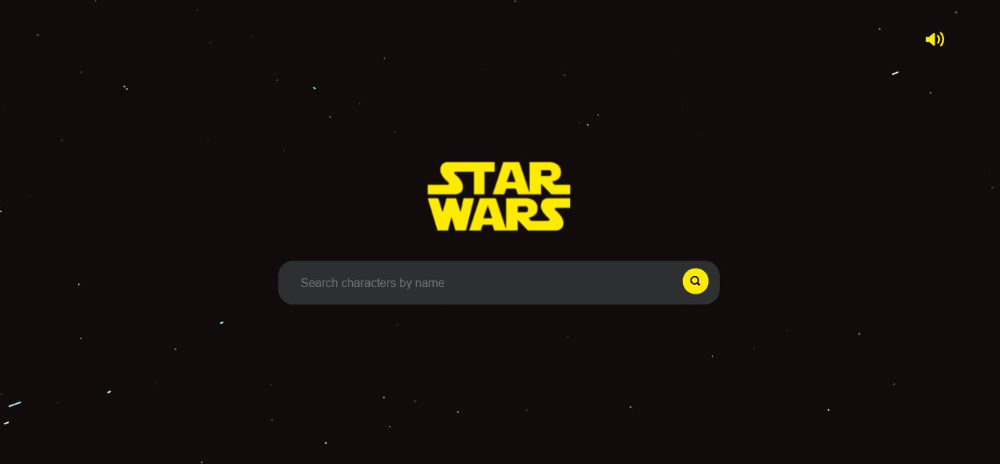
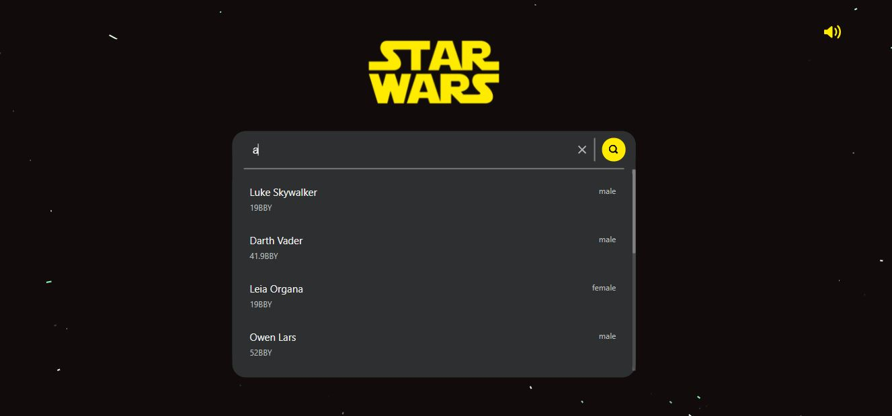
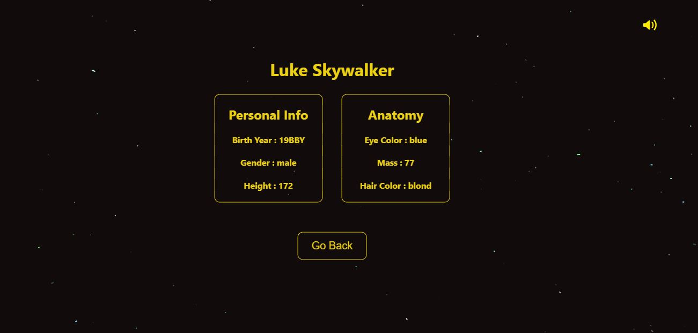

# StarWars Characters Searchbar 🌌

 

This repository contains the **StarWars Characters Searchbar** that was build as an assignment during interview process at **UrbanPiper**. It helps users to search about their favourite characters of Star Wars Universe. Enjoy and **May the force be with you**

 

# Technology Stack Used 💻

In this project we have used the following tech stack.

- React.js
- CSS
- HTML
- JavaScript

 

## Libraries Used 🌟

1. axios
2. react-router-dom
3. react-dom
4. react-sound
5. react-starfield-animation
6. styled-components
7. uuid

 

## Snapshots 📷

1. Landing Page
   

2. Search Results
   

3. Character Page

    

## How To Run This Project 📑

1. Clone the respository on your local system
2. Navigate to the project and open in VS Code
3. Open terminal and install the node modules by running the command <code> npm install </code>
4. After the packages have been installed run the command <code>npm start</code>
5. A session will be created on the browser and the app will run on <code>http://localhost:3000/</code>
6. Now you can search for any character and then select the charater from the search results using up/down arrow keys or cursor.
7. You can view details of the selected character by clicking on the search result or by simply pressing enter.

 

## Features

1. User can search any character from the Star Wars universe
2. User can play/stop the theme track audio
3. User can navigate the search results using both mouse and up/down arrow keys
4. User can Goto a paticular character's page by clicking or by hitting enter

 

## Known Bugs

1. Scrollbar CSS is not optimised.
2. Placeholder for searchbar not optimised for smaller devices.
3. Star animation glitches on playing or pausing the audio.

 

## Easter Egg

Wanna know what happened to Anakin Skywalker when he joined the dark side? Search for the name he got after he became the super villan.

 

## Live Demo

https://star-wars-searchbar.vercel.app/

 
